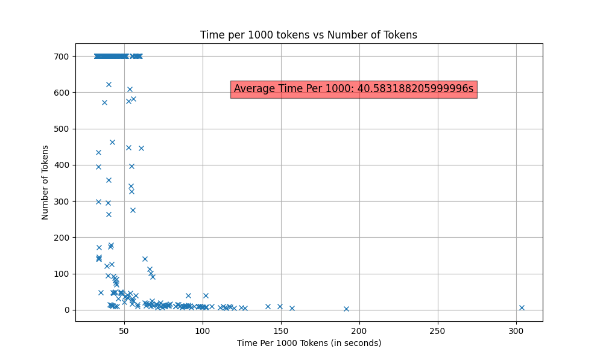
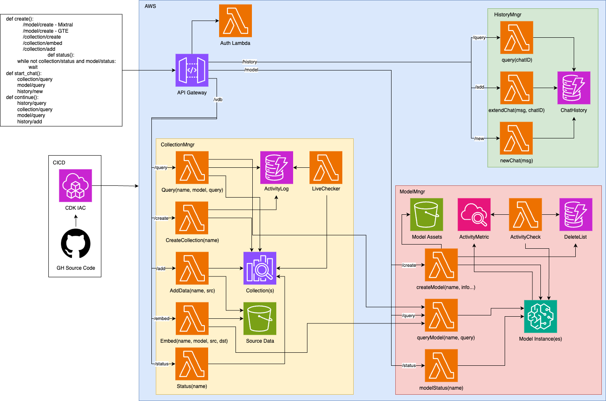

# Valyu LLManager - Simplifying MLOps for Self-Hosted LLM Inference 🛠️
As an LLM application developer, managing infrastructure, permissions and security for the entire LLM stack (embeddings models, vector databases, LLMs, caching, logging, api-endpoints etc.) can get very complex and costly. This is even before you start building out your actual application level logic. 

We recognised this when we started building scalable LLM applications. Deploying complete, maintainable high-performance Large Language Models applications was cumbersome. So we built the Valyu LLM Manager 🛠️

Valyu LLManager reigns in this cost and complexity, easing the strain on your development and operations teams when building applications. It is easy- you can create or destroy entire model instances and supporting resources (vector databases, embeddings models etc.), with autoscaling, including scaling to zero. It supports any open-source LLM (Mistral, Llama3 etc.), any embeddings models on the `MTEB` keaderboard as well as custom-trained solutions. It is AWS centric atm but we are making it agnostic :)

Scale immediately, with complete control over your model infrastructure, while paying only for what you actually use.

You can retain complete control over your infrastructure and easily modify the framework, according to your needs.

### Pricing Benchmarks

(These are being refined as we optimise more)

Total Cost Estimates:

|                | On-Demand | Reserved |
|----------------|-----------|----------|
| **SageMaker**  |           |          |
| LLM Model      | $1.212    | $0.485   |
| Embedding      | $1.212    | $0.485   |
| **OpenSearch** |           |          |
| Indexing       | $0.24     | $0.24    |
| Search         | $0.24     | $0.24    |
| **ElasticBeanstalk** |     |          |
| Server         | $0.11     | $0.051   |
| **Total**      | $3.014    | $1.501   |
| **Monthly**    | $2200     | $1095    |

Estimate of cost-per-query:



|                | On-Demand       | Reserved       |
|----------------|-----------------|----------------|
| Self-hosted    | $0.03/query     | $0.017/query   |
| GPT-3          | $0.003/query    |                |
| GPT-4          | $0.04/query     |                |

While This is more expensive than OpenAI APIs, it retains complete control over infrastructure. We are also currently working to optimize this to approach API pricing.

[we are publishing a paper with all our results and design rationale]

0. [Quickstart](#0---quickstart)
1. [Example](#1---example)
2. [Introduction](#2---introduction)
3. [Features](#3---features)
4. [Architecture](#4---architecture)
5. [API Reference](#5---api-reference)
6. [Contribution](#6---contribution)

## 0 - Quickstart

To deploy in your environment:
0. Fork this
1. Activate Python Env `source .venv/bin/activate && pip install -r requirements.txt`
2. Create a `.env` file (base off [.env.template](./.env.template)) 
3. Add your AWS credentials (`AWS_ACCESS_KEY_ID`, `AWS_SECRET_ACCESS_KEY`, `AWS_REGION`)
4. Execute `chmod +x ./run.sh`
5. Execute [./run.sh](./run.sh)

There is also a template for a GitHub action under [./.github/workflows](./.github/workflows/deploy.yml). If you are using actions make sure you have added your AWS credentials to the actions workflow secrets of this repo. 

Modify [auth](./src/auth/lambda_function.py) first to define how to secure your API.

## 1 - Example

See [example.py](./example_app/example.py) for an implementation.

You must setup and deploy an API first, as well as update the API URL in that function, and include any `auth` components you may require

### 1.1 - Provision Resources

To create an LLM instance, embedding model and vector database is as simple as:

```python
requests.post(f"{api_url}/model/create", json={"name": llm_name, "model": "mistral-7b"})

requests.post(f"{api_url}/model/create", json={"name": embed_name, "model": "gte-large"})

requests.post(f"{api_url}/vdb/create", json={"name": vdb_name})
```

### 1.2 - Start a Chat

To chat with the LLM, while querying data from the vector database, only requires one API call for each high-level action:

```python
response = requests.post(f"{api_url}/vdb/query", json={"model": embed_name, "query": query, "name": vdb_name})

vdb_data = response['data']

response = requests.post(f"{api_url}/model/query", json={"model": model_name, "query": query})

answer = response.json()["response"]

response = requests.post(f"{api_url}/history/new", json={"q": query, "a": answer})

chat_id = response.json()["chat_id"]
```

### 1.3 - Continue a Chat

To continue a chat, simply pass the chat ID to the API:

```python
response = requests.post(f"{api_url}/history/get", json={"chat_id": chat_id})

chat_data = response.json()

response = requests.post(f"{api_url}/vdb/query", json={"model": embed_name, "query": query, "name": vdb_name})

vdb_data = response['data']

response = requests.post(f"{api_url}/model/query", json={"model": model_name, "query": query})

answer = response.json()["response"]

requests.post(f"{api_url}/history/append", json={"q": query, "a": answer, "chat_id": chat_id})
```

### 1.4 - Delete Resources

When you're done using your models, they may either be configured to automatically delete, or may be deleted manually:

```python
requests.post(f"{api_url}/model/delete", json={"name": llm_name})

requests.post(f"{api_url}/model/delete", json={"name": embed_name})

requests.post(f"{api_url}/vdb/delete", json={"name": vdb_name})
```

## 2 - Introduction

This is an API to create and manage resources painlessly for AWS-based inference deployments of Large Language Models (or similar architectures).

Many deployments of LLM's require complex resources, such as vector databases, storage systems for chat history, embedding models for vector storage to enable RAG and of course the core model. Each of these components adds operational complexity for system admins. A rough sketch of such systems is shown below:


The Valyu LLManager creates an API to abstract the operational complexity of managing all of these components, by creating, scaling, managing and deleting the relevant AWS resources for these complex systems.

Another prohibitive factor is often cost and as such, resources created by Valyu's LLManager can be set up to be automatically deleted after some period of time if inactive.

LLManager reduces the complexity, cost and challenge of deploying LLM models, letting you get started with custom models in seconds, not months! It's designed for engineers or researchers who want more control over their models than that offered by APIs, but who don't want to invest the time and resources in developing custom hosting solutions from scratch.

## 3 - Features

- Manage SageMaker Models
    - Create models from a collection of Jumpstart models, simply by providing a name and instance type, or provide resources for custom models.
    - Set up models to scale up automatically with demand.
    - Set up instances to tear down after some period of inactivity.
    - Query models with tools such as LangChain
    - Take full advantage of AWS monitoring features, and take away the complexity and management overhead when creating many models or instances.
- Chat with LLMs
    - Take advantage of a custom, easy-to-use API, whcih is totally optional.
    - Track conversations, retrieve chat histories, and quickly and easily save new conversations.
- Implement RAG in seconds
    - Use the custom Vector Database API to embed, save and retrieve data in a managed way
    - Takes advantage of OpenSearch Serveless Collections, with ability to scale up demand, and provide a large number of isolated databases, running on the same underlying compute pool.
    - Embed, save and quickly load data from S3
    - As with the models, have the ability to shut down unused databases, which can quickly be restored from S3, for rarely accessed data.

## 4 - Architecture

- All application architecture is managed through CDK
- Queries pass through an API Gateway
- All queries are handled by Lambdas, which call other supporting infrastructure, this reduces running costs.
- Includes a bare-bones Authorization lambda, which may be modified according to application needs. 
- Split into three components, model management, vector database management and history management.
- Model management includes models hosted on SageMaker, relevant model resources stored on S3, and a DynamoDB table to track activity of models
    - A lambda will periodically check DynamoDB and Cloudwatch, to identify any models which are not being used. Any such models then trigger a call to a second Lambda, which deletes those models.
- Vector database manager includes data stored on an OpenSearch, an embedding model (implemented by the model manager), and a DynamoDB table also to track activity.
    - Many `collections' may be implemented on a single OpenSearch serverless cluster. This makes it possible to have large numbers of isolated vector databases.
    - Each isolated collection is tracked and deleted if inactive.
    - To help with this notion of temporary infrastructure, data is embedded through a dedicated endpoint. The source of the data must (currently) be in S3, and is then embedded and stored again in a separate S3 bucket. 
    - Then, when a collection is created, the embedded qdata may be loaded in from S3.
    - This is designed for a workload of large quantities of immutable data which is infrequently accessed, but in a highly bursty manner. Different workloads may benefit from slightly different structures. 
- History Manager provides controlled access to a DynamoDB table
    - Endpoints are placed in front of the data, abstracting common access patterns, creating new conversation records, appending to an existing conversation and getting the contents of an existing conversation.



## 5 - API Reference

API Arguments to be finalized, but endpoints include:

- /models
    - /create
    - /delete
    - /status
    - /query
- /vdb
    - /create
    - /query
    - /embed
    - /add
    - /delete
    - /statys
- /history
    - /new
    - /append
    - /get

## 6 - Contribution

Shoutout to the 🐐 [@jl3nn](https://github.com/jl3nn) for building this.

**Guidelines**
- Use a new branch
- Create a PR, with a semantic name
- Squash & Merge Only for PRs
- All PRs must be reviewed before being merged
- Be sensible :)

🛠️ We Build
